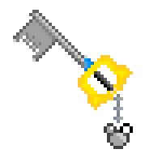
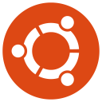
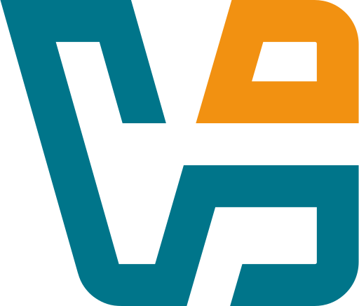
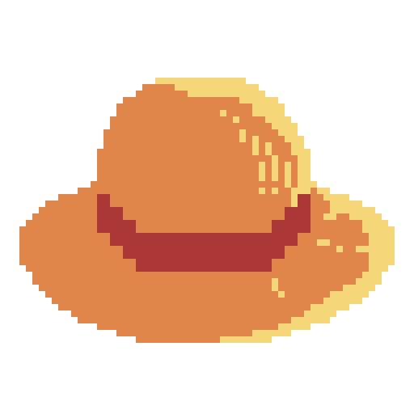

  <ul style="list-style: none;">
    

      <h1>Hi ! I'm Nimpô ! 👾</h1>
    

  </ul>

	<ul style="list-style: none;">
		
		

			<h2>Computer programming student at 42 Nice ⛱👒</h2> 
			<h2>Video game enthusiast 🎮🕹️</h2>
		

	</ul>

#

  <ul>
    

      <h1>My Technical Skills 🗝️</h1>
    

  </ul>

<table>
  <tr>
    <td align="center" valign="middle" style="font-size: 20px;">
      Main Languages
    </td>
    <td align="center" valign="middle">
      
      
      
      
    </td>
  </tr>

  <tr>
    <td align="center" valign="middle" style="font-size: 20px;">
      DevOps
    </td>
    <td align="center" valign="middle">
      
      
      
      
      
    </td>
  </tr>

  <tr>
    <td align="center" valign="middle" style="font-size: 30px;">
      Operating Systems and Virtualization
    </td>
    <td align="center" valign="middle">
      
      
      
      
      
    </td>
  </tr>
</table>

  <ul>
    

      <h1>Other Skills 👒</h1>
    

  </ul>

<table align="right">
  <tr>
    <td align="center" valign="middle">
      
      
      
      
    </td>
    <td align="center" valign="middle" style="font-size: 30px;">
      Web Languages
    </td>
  </tr>

  <tr>
    <td align="center" valign="middle">
      
      
      
      
    </td>
    <td align="center" valign="middle" style="font-size: 20px;">
      Frameworks and Libraries
    </td>
  </tr>

  <tr>
    <td align="center" valign="middle">
      
      
      
      
      
    </td>
    <td align="center" valign="middle" style="font-size: 20px;">
      Others
    </td>
  </tr>
</table>

 
 
 
 
 
 
 
 
 
 
 

#

  <ul align="left">
    

      <h1>About me 🕸️</h1>
    

  </ul>

As a student at [42 Nice](https://42nice.fr/en/homepage/), it was here that I discovered the world of programming. Embarking on my journey in the world of <ins>**DevOps**</ins>, this adventure is shaping who I am becoming: **a code enthusiast, a technology lover, and above all, a fan of automation**.

Besides my work, I am a huge video game enthusiast and player, and a huge fan of <ins>**versus fighting games**</ins>. I'm currently focusing on **Tekken 8** ([**Nimpo__**](https://profile.playstation.com/Nimpo__) on **Playstantion Network**).

  <ul>
    

      <h3>You can contact me 🐌:</h3>
    

  </ul>

<!-- - 🔭 I’m currently working on **Kubernetes, Argo CD, and all other DevOps's tools you can imagine** (and maining **[Azucena on Tekken 8](https://fr.bandainamcoent.eu/tekken/tekken-8/characters/azucena-milagros-ortiz-castillo)**, I am ranked `Assailant`)
- 🌱 I’m currently learning **the job of a DevOps** (and **Unity** for making video games)
- 📫 How to reach me: <marwan.ayoub.pro@gmail.com> ([Discord](https://discordapp.com/users/410390554212564992) and [PlayStation](https://profile.playstation.com/Nimpo__))

## About me
Passionate about programming and video games, and a budding professional in the world of DevOps, I spend my time exploring new interests and improving in the areas I am most passionate about. As a student at 42 Nice, it is here that I discovered the world of programming, shaping who I have become today: a code enthusiast, a technology lover, and above all, a fan of **<u>automation</u>**. -->
